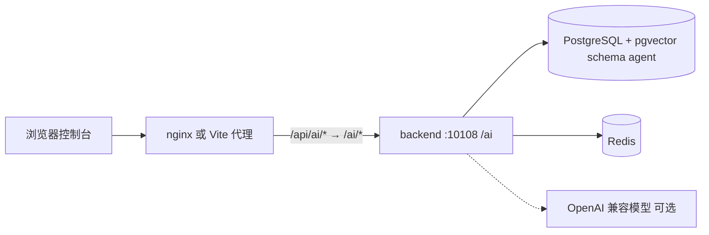

# 整体架构

Business Agent 是可独立运行的 Agent 平台：控制台 + HTTP API + PostgreSQL/Redis。不依赖网关、配置中心、IAM 或业务中台。

**后端分层、模块、问答主链路、安全处理的完整说明见 [backend.md](backend.md)。**

## 进程视图



| 进程 | 代码 | 职责 |
|---|---|---|
| frontend | Vue 3 + Vite + Element Plus | 智能体 / 技能 / 数据源 / 模型 / 运行页 |
| backend | Spring Boot 3.5 / Java 17 | REST + SSE + MCP 服务端 |
| framework-lite | 同仓 Maven 模块 | 异常、实体基类、MP Wrapper、ThreadLocal 用户、Redis 锁 |
| postgres | schema `agent` | 元数据、会话、向量、技能定义 |
| redis | 会话/锁/缓存 | AgentScope v2 状态、分布式锁 |

演示身份不走登录服务：`OpenAccessFilter` 把 `PLATFORM_ADMIN` 写入 `ThreadLocalHolder`（键 `USER_INFO_KEY`），`AuthenticationContext` 只读该 ThreadLocal。

## 逻辑分层

```
frontend  views/ai-agent + 最小壳
backend  controller  → service / skill / routing / flow
          agentscope  → HarnessAgent + 工具适配
          connector   → JDBC 探查与受控 SQL
framework-lite        → 持久化与 Web 基础设施
```

文件上传不经过对象存储：`LocalFileController` 把文件落到 `AGENT_STORAGE_DIRECTORY`，返回绝对 HTTP URL（`/ai/files/{id}`）。

## 明确不做

- 不内置 OMS/WMS/结算等业务系统。
- 不内置 IAM。数字员工 / IM / 可见性审批页面可打开，外部联通默认关。
- 不读取 Nacos。配置即仓库内 yaml + 环境变量。

## 技术选型（与代码一致）

- Agent 运行时：AgentScope Java **2.0.1 HarnessAgent**
- 模型：Spring AI 1.1，OpenAI 兼容端点
- 向量：pgvector，余弦，1024 维
- API 文档：Knife4j `http://localhost:10108/ai/doc.html`
