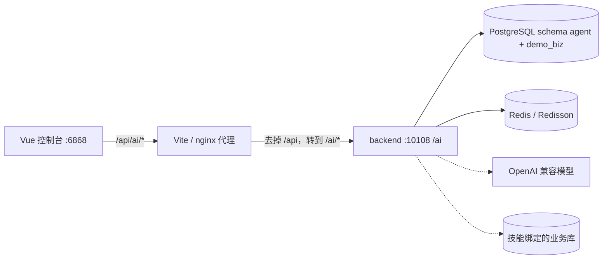
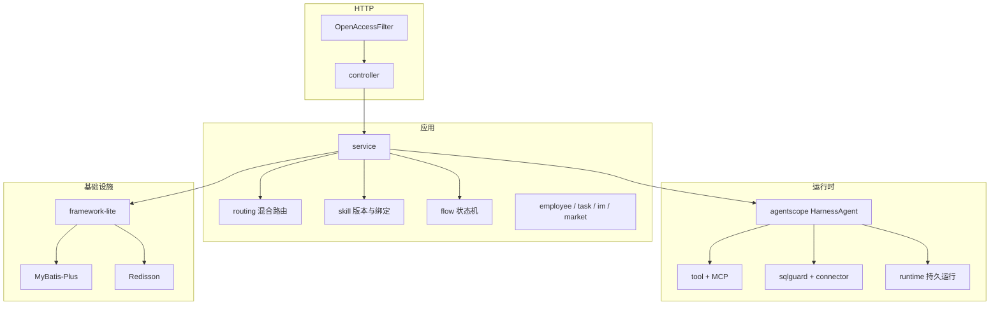
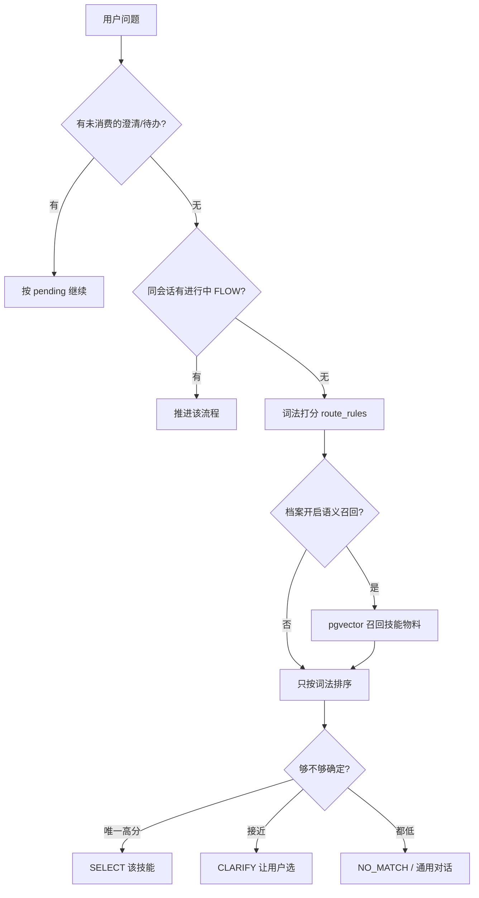
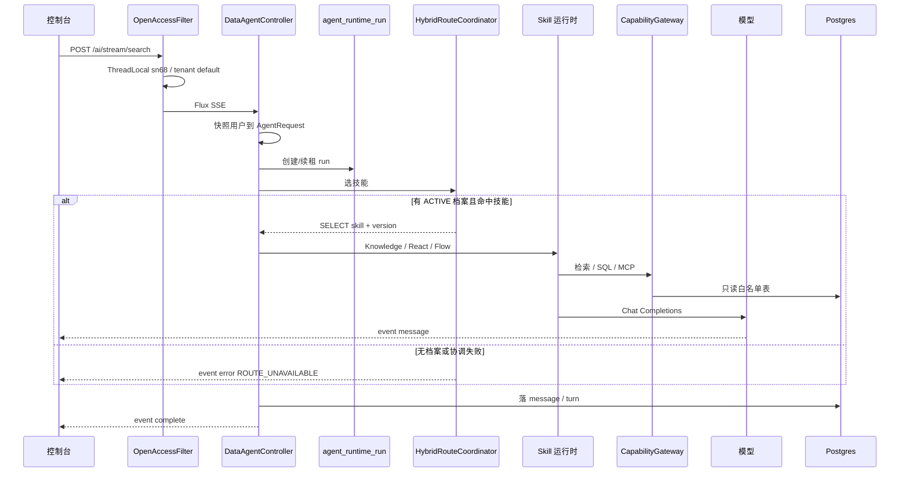
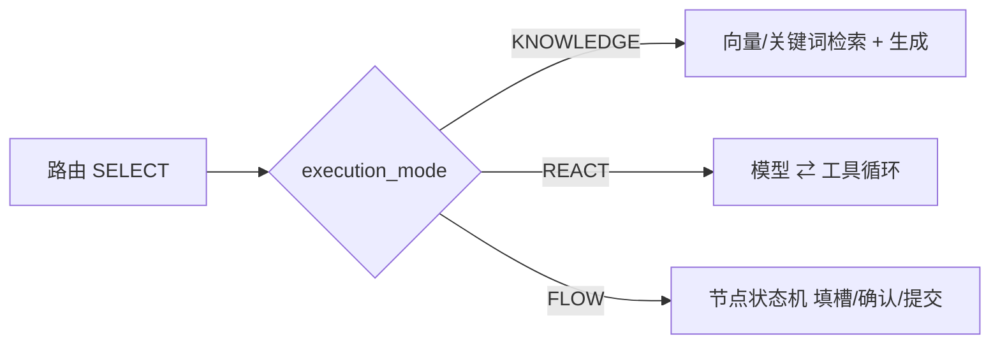
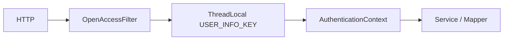

# 后端设计说明

本文说明 **business-agent 后端**（`backend/`，入口 `com.sn68.agent.AgentApplication`）怎么分层、用了什么、问答怎么走、安全怎么挡。读完应能独立改代码或对接控制台。

配套：启动见 [getting-started.md](getting-started.md)，配置见 [configuration.md](configuration.md)，HTTP 路径摘要见 [runtime-flow.md](runtime-flow.md)。

---

## 1. 它是什么

独立 Agent 运行时 + 管理 API：

- 控制台管理智能体、技能、数据源、模型
- 用户提问走 **SSE 流式问答**
- 按问题选出技能：知识问答 / 工具循环（React）/ 确定性流程（Flow）/ NL2SQL
- 不内置 OMS/WMS/结算；不连 Nacos、网关、IAM

演示模式无登录。每个 HTTP 请求被注入用户 `sn68`、租户 `default`、角色 `PLATFORM_ADMIN`。

context-path 固定 **`/ai`**，默认端口 **10108**。API 文档：http://127.0.0.1:10108/ai/doc.html

---

## 2. 进程与边界



| 进程 | 职责 |
|---|---|
| backend | REST、SSE、MCP Server、定时探测 |
| PostgreSQL | 元数据、会话、运行记录、向量 `agent.vector_store`（1024 维）；演示业务表在 `demo_biz` |
| Redis | 分布式锁、AgentScope v2 会话状态（前缀 `as2:`） |
| 模型 | CHAT / EMBEDDING / ASR / TTS；走 Spring AI，OpenAI 兼容端点 |
| 业务库 | 技能数据源登记的 JDBC；NL2SQL 只打表白名单 |

前端 dev 代理：`/api/ai/foo` → `http://localhost:10108/ai/foo`。

---

## 3. 逻辑分层



| 层 | 包 | 做什么 |
|---|---|---|
| HTTP | `dataagent.controller`、`dataagent.config` | 入参校验、SSE、上传；过滤器注入身份 |
| 应用 | `dataagent.service`、`skill`、`routing`、`flow` | 智能体/技能 CRUD、选技能、流程推进 |
| 运行时 | `dataagent.agentscope`、`runtime`、`capability` | Harness 循环、工具、可恢复 run、能力网关 |
| 连接 | `dataagent.connector`、`agentscope.tool.sqlguard` | 探 schema、受控 SQL |
| 基础设施 | `com.sn68.agent.framework` | 异常、实体、Wrapper、ThreadLocal、Redis 锁、全局包装 |

入口类扫描 `com.sn68.agent`，排除 Mongo 自动配置。Mapper 扫 `com.sn68.agent.**.repository`。

---

## 4. 技术栈与组件

| 类别 | 选型 | 版本 / 说明 |
|---|---|---|
| 语言 | Java 17 | — |
| 应用框架 | Spring Boot | 3.5.8 |
| Web | spring-boot-starter-web + websocket | SSE、实时语音 WS |
| 云 BOM | Spring Cloud | 2025.0.0（只用少量 commons，无 Nacos） |
| ORM | MyBatis-Plus | 3.5.12，查询用 `Wraps`，禁止手写单表 SQL |
| 连接池 | HikariCP | `connection-init-sql: SET search_path TO agent, public` |
| 缓存/锁 | Redis + Redisson | 3.52.0 |
| Agent 运行时 | AgentScope Java HarnessAgent | **2.0.1** |
| 模型 SDK | Spring AI | 1.1.0，OpenAI 兼容；可接 DashScope 等 |
| 向量 | pgvector | 余弦，表 `agent.vector_store`，列 `vector(1024)` |
| 校验 | Jakarta Validation | — |
| 文档 | Knife4j | `/ai/doc.html` |
| 工具库 | Hutool 5.8、Guava、TTL | 异步租户用 TransmittableThreadLocal |
| 观测 | Actuator + 可选 OpenTelemetry / Langfuse | 默认关 |
| 加密 | AES-GCM | `spring.ai.agent.crypto`；开源默认 **enabled=false** |
| 本仓基础库 | `framework-lite` | `com.sn68.agent.framework.*` |

配置前缀 **`spring.ai.agent.*`**（不是旧的 `spring.ai.xx.data-agent`）。

---

## 5. 核心模块

### 5.1 智能体与会话

| 模块 | 位置 | 职责 |
|---|---|---|
| 智能体 | `service` + `DataAgentManageController` | 创建/发布/绑定技能与模型 |
| 会话 | `ChatController`、`service.chat` | 会话、消息、回合 `data_chat_turn` |
| 流式问答 | `DataAgentController` `POST /stream/search` | SSE，类上无 `/data-agent` 前缀 |
| 停止 | `POST /chat/runtime/stop` | 写 interruption，运行时轮询取消 |

### 5.2 技能

技能是可发布的能力单元，绑定到智能体后才能被路由选中。

| 字段 | 含义 |
|---|---|
| `skill_kind` | `KNOWLEDGE` / `ACTION` / `ORCHESTRATION` 等 |
| `execution_mode` | `KNOWLEDGE` 检索生成；`REACT` 工具循环；`FLOW` 确定性节点 |
| `route_rules` | 词法：exact / phrases / aliases / 正负例，供混合路由打分 |
| `published_version_id` | 运行只吃已发布版本 |

NL2SQL 技能另绑：数据源表白名单、业务知识、语义模型、逻辑关系。

### 5.3 混合路由

`dataagent.routing`。租户必须有一条 **`data_agent_route_profile.status = ACTIVE`**，否则问答在选技能前失败（`ROUTE_PROFILE_UNAVAILABLE`）。



演示种子 `seed-demo.sql` 写入词法档案 `demo-lexical-default`（语义召回关闭，不依赖向量产物）。

### 5.4 AgentScope 运行时

`AiAgentRuntimeServiceImpl.streamSearch`：

1. 校验 `threadId`、智能体已发布、模型已配
2. 创建/续租 `agent_runtime_run`（CAS 状态、lease、fence）
3. 调混合路由
4. 按技能模式进 Knowledge / React / Flow
5. 通过 `CapabilityGateway` 调工具（SQL、检索、MCP）
6. SSE 推 `message` / `runtime_progress` / `complete` / `error`
7. 落 `data_chat_message`、`data_chat_turn`

异步线程用 `DataAgentAsyncContextBridge` 拷贝租户与用户，避免 ThreadLocal 丢上下文。

### 5.5 Flow

`dataagent.flow`：多轮填槽。实例表 `data_agent_flow_instance`（含 `input_hash` / `context_revision` / `resume_version` 防重放）。等待用户时状态 `WAITING`，恢复时校验 hash 与版本。

### 5.6 数据源与 SQL

`connector` 按类型拼 JDBC（禁止调用方塞完整 URL 参数）。`sqlguard` 解析 SQL、对齐表白名单、可用 EXPLAIN。技能只能打 `skill_datasource_tables` 里的表。

### 5.7 工具与 MCP

工具中心登记 HTTP/脚本/MCP 工具；本进程也可当 MCP Server。`tool-center.mcp-client.enabled` 默认 false。

### 5.8 数字员工 / 任务 / IM / 市场 / 评估

包都在，页面可开。钉钉、任务调度默认关。评估与自优化走独立表，不挡主问答。

### 5.9 framework-lite

| 能力 | 类 |
|---|---|
| 业务异常 | `CheckedException` |
| 实体/审计 | `SuperEntity`、`MyBatisMetaObjectHandler` |
| 查询 | `Wraps` / `LbqWrapper` |
| 身份 | `AuthenticationContext` 读 ThreadLocal `USER_INFO_KEY` |
| 锁 | `RedisLockHelper` |
| HTTP | 全局 JSON 包装；SSE 用 `@IgnoreGlobalResponse` |
| 访问日志 | `@AccessLog`，不打 token |

---

## 6. 支持的功能（产品视角）

| 能力 | 开源演示是否默认可跑 |
|---|---|
| 智能体 CRUD / 发布 / 绑定技能与模型 | 是 |
| SSE 流式问答 | 是（需 CHAT 模型 + ACTIVE 路由档案） |
| 技能三种执行模式 | 是 |
| NL2SQL（表白名单 + 语义列 + 业务术语） | 是（需数据源与本月演示表） |
| 知识库 / RAG（1024 维 embedding） | 需 embedding 模型 |
| 混合路由（词法；可选向量 + 模型消歧） | 词法默认开 |
| 数据源探查与受控查询 | 是；登记 host 有 SSRF 黑名单 |
| 工具中心 / MCP Server | 是；MCP Client 默认关 |
| 运行记录、会话排障、Token 用量 | 是 |
| 数字员工、技能市场、权限中心 | 页面可用；外部审批默认关 |
| IM（钉钉等） | 默认关 |
| 可见性审批 / PEP 强制拦截 | 默认 SHADOW，不拦对话 |
| 本地文件上传 | `POST /ai/files/upload` |

---

## 7. 问答主链路

关键 HTTP：

| 步骤 | 方法 | 路径（后端） |
|---|---|---|
| 列智能体 | POST | `/ai/data-agent/query` |
| 建会话 | POST | `/ai/chat/sessions/create`  body `{ agentId }` |
| 流式问 | POST | **`/ai/stream/search`**  必须带 `threadId` |
| 停 | POST | `/ai/chat/runtime/stop` |



SSE 事件：`message`、`runtime_progress`、`complete`、`error`。控制器带 `@IgnoreGlobalResponse`，不要用普通 JSON 包装套住事件流。

常见失败码：

| 码 | 含义 |
|---|---|
| `threadId must not be empty` | 没先建会话 |
| 未配置模型 | `model_config` 无可用 CHAT |
| `ROUTE_PROFILE_UNAVAILABLE` | 租户没有 ACTIVE 路由档案 |
| `ROUTE_COORDINATOR_FAILED` | 路由抛错（常见是表缺列） |
| `ROUTE_ELIGIBILITY_INVALID` | 技能绑定租户/发布状态不合法 |

执行模式分流：



---

## 8. 安全处理

开源默认**无登录墙**，但运行时仍有租户、SQL、数据源、密钥几道闸。

### 8.1 身份（演示）



- `OpenAccessFilter`（最高优先级）写入 `UserInfoDetails`：userId=`1`，username=`sn68`，tenantId=`default`，type=`PLATFORM_ADMIN`
- `AuthenticationContextConfiguration` **只读**该 ThreadLocal，不调 Sa-Token
- 异步：`DataAgentAsyncContextBridge` 拷贝同一套用户
- 没有登录、没有按钮权限、前端 `haveAuth()` 恒 true

上生产应换成真实认证，并收紧管理员类型。

### 8.2 租户

业务表带 `tenant_id`。查询跟当前上下文走。平台管理员在部分管理接口上可跨看，对话数据仍按租户隔离。种子与演示数据一律 `default`。

### 8.3 授权 PEP（默认旁路）

`spring.ai.agent.authorization.mode=SHADOW`：评估策略并记观测，**不拦截**对话。`ENFORCE` 才会按策略拒绝。`enforce-tenant-ids` 默认空。

可见性策略默认 `TENANT` + 申请 `DISABLED`，目录对租户内可见。

### 8.4 数据源 SSRF

登记/更新数据源时 `DatasourceConnectionGuard`：

- JDBC URL 由服务端模板拼，调用方不能带 `?&=;` 改驱动参数
- 拒绝回环、链路本地、云元数据 IP（`169.254.169.254` 等）
- 本地演示数据源是 SQL 直接插入 `127.0.0.1`，不走该守卫；控制台「测试连接」保存时仍会校验

### 8.5 SQL 守卫

NL2SQL / 查询工具：

1. 只允许技能白名单表
2. 解析 SQL，对齐语义列
3. 可选 EXPLAIN
4. 写操作走能力网关与风险等级，不默认开放任意 UPDATE/DELETE

### 8.6 密钥

| 项 | 行为 |
|---|---|
| `model_config.api_key`、数据源密码 | `crypto.enabled=true` 时 `enc:gcm:` 入库 |
| 开源默认 | `crypto.enabled=false`，明文（仅本地） |
| 接口出参 | 模型配置 DTO 脱敏 |
| 访问日志 | `@AccessLog(request=false)` 避免打 Key |

### 8.7 其它

- 对话附件必须是本服务上传后的绝对 URL（`/ai/files/{id}`），拒绝任意外链当本地文件
- 代码执行默认 `ai_simulation`，禁止本机随便跑用户代码
- 全局异常 `CheckedException` → 业务码；SSE 用 `event:error` 而不是把堆栈灌给浏览器

---

## 9. 持久运行与表

问答一次对应：

| 表 | 作用 |
|---|---|
| `data_chat_session` / `data_chat_message` / `data_chat_turn` | 会话与回合（含路由结果码） |
| `agent_runtime_run` | 权威运行：状态机、租约、`owner_type/owner_id` |
| `agent_runtime_event` | 进度事件（SSE 可对账） |
| `data_agent_route_profile` / `data_agent_route_artifact` | 路由档案与技能物料 |
| `data_agent_flow_instance` | FLOW 多轮实例 |
| `vector_store` | RAG / 路由向量，schema **`agent`** |
| `demo_biz.*` | 订单/账单演示业务表 |

`agent_runtime_run` 用 `state_version` CAS、`lease_owner/lease_until/fence_token` 防双执行。

---

## 10. 目录速查

```
backend/src/main/java/com/sn68/agent/
  AgentApplication.java
  dataagent/
    controller/          HTTP
    agentscope/          Harness、工具、记忆
    routing/             混合路由
    skill/  flow/        技能与流程
    connector/           JDBC
    runtime/             可恢复 run
    authorization/       PAP/PEP
    service/             应用服务
    config/              OpenAccess、MCP、线程池
  resources/
    config/*.yaml        本地配置（无 Nacos）
    sql/pg/schema.sql    建表
    sql/pg/seed-demo.sql 演示智能体 + 路由档案
```

改问答：先看 `AiAgentRuntimeServiceImpl` 与 `HybridRouteCoordinator`。改 SQL 安全：`sqlguard` + `DatasourceConnectionGuard`。改身份：`OpenAccessFilter` + `AuthenticationContextConfiguration`。
