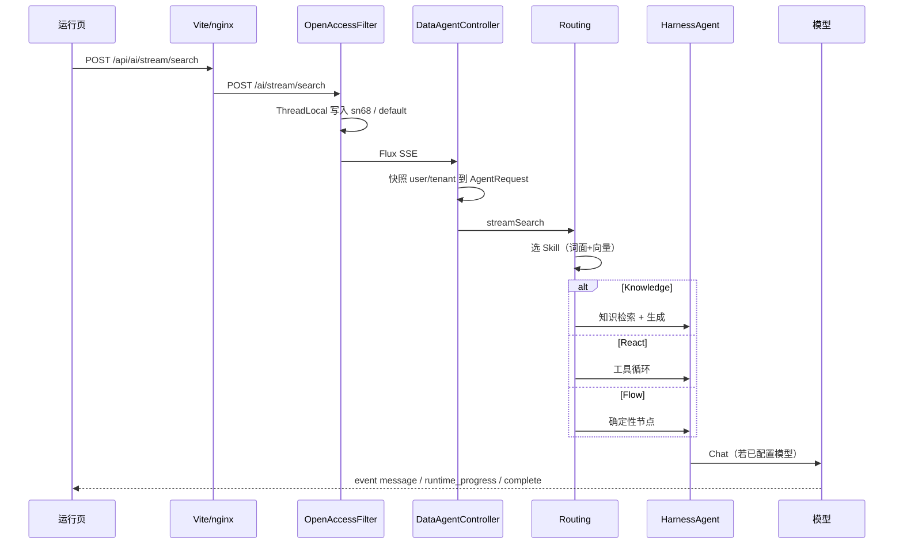

# 主链路

完整时序、失败码与执行模式分流见 [backend.md](backend.md) 第 7 节。

## HTTP 前缀

后端 `server.servlet.context-path=/ai`。

| 用途 | 浏览器（dev 有代理） | 后端真实路径 |
|---|---|---|
| 管理 CRUD | `/api/ai/data-agent/...` | `/ai/data-agent/...` |
| 流式对话 | `/api/ai/stream/search` | **`/ai/stream/search`** |
| 停止运行 | `/api/ai/chat/runtime/stop` | `/ai/chat/runtime/stop` |
| 本地上传 | `/api/ai/files/upload` | `/ai/files/upload` |
| 健康检查 | — | `/ai/actuator/health` |

`DataAgentController` 没有 class-level `@RequestMapping`。前端 `graph.ts` 使用 `API_BASE_URL = '/ai'`。配错成 `/ai/data-agent/stream/search` 会 404。

## 对话时序

SSE 事件名：`message`、`complete`、`error`、`runtime_progress`。控制器带 `@IgnoreGlobalResponse`，不要用普通 JSON 包装套住事件流。

## 身份

1. `OpenAccessFilter` 设置 `USER_INFO_KEY`
2. `AuthenticationContextConfiguration.getContext()` **只读** ThreadLocal，不调用 Sa-Token
3. 异步线程由 `DataAgentAsyncContextBridge` 拷贝同一套用户，避免租户丢失

可见性默认 TENANT + 申请 DISABLED。PEP 默认 SHADOW，不拦截演示对话。管理员类型 `PLATFORM_ADMIN` 会绕过思考过程等权限短路。

## 模型

- 有 `AGENT_OPENAI_API_KEY`：启动时 `DemoModelSeeder` 写入 `model_config`
- 无 Key：对话返回业务错误「未配置模型，请在模型配置页添加」
- 知识问答还需要 1024 维 embedding；仅聊天可以只有 CHAT 模型

## 文件

上传 `POST /ai/files/upload` → 磁盘 + `agent_file` 行 → 返回 `http://localhost:10108/ai/files/{id}`。对话附件必须是这种绝对 URL，相对路径 `/uploads/` 会被拒绝。
